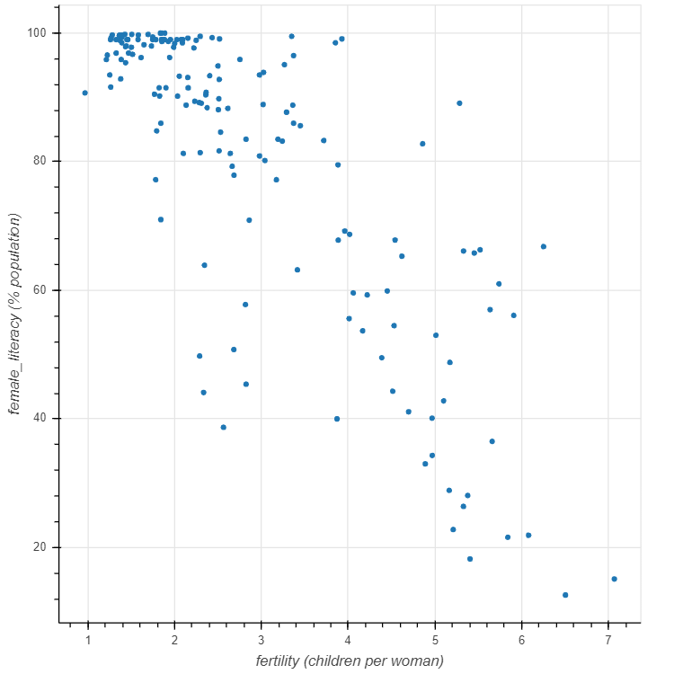
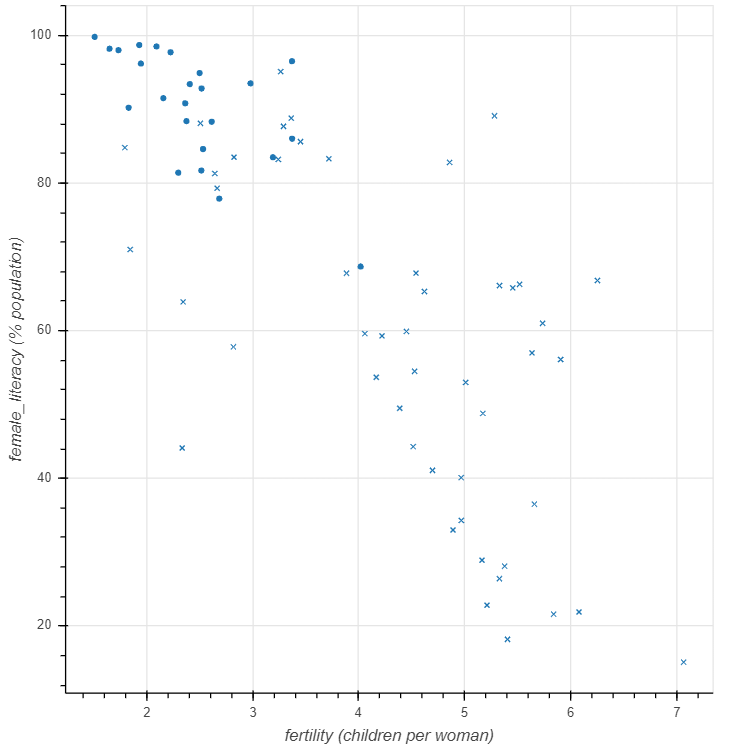
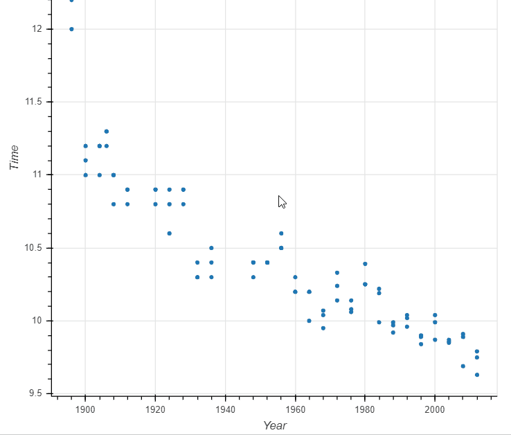

# Interactive Data Visualization with Bokeh

## Cahpter 1 : Basic plotting with Bokeh

### Scatter Plot
```python
# Import figure from bokeh.plotting
from bokeh.plotting import figure

# Import output_file and show from bokeh.io
from bokeh.io import output_file, show

# Create the figure: p
p = figure(x_axis_label='fertility (children per woman)', y_axis_label='female_literacy (% population)')

# Add a circle glyph to the figure p
p.circle(fertility, female_literacy)

# Call the output_file() function and specify the name of the file
output_file('fert_lit.html')

# Display the plot
show(p)
```
>>

### A scatter plot with different shapes
```python
# Create the figure: p
p = figure(x_axis_label='fertility (children per woman)', y_axis_label='female_literacy (% population)')

# Add a circle glyph to the figure p
p.circle(fertility_latinamerica, female_literacy_latinamerica)

# Add an x glyph to the figure p
p.x(fertility_africa, female_literacy_africa)

# Specify the name of the file
output_file('fert_lit_separate.html')

# Display the plot
show(p)
```
>>

### Customizing your scatter plots
```python
# Add a blue circle glyph to the figure p
p.circle(fertility_latinamerica, female_literacy_latinamerica, color='blue', size=10, alpha=0.8)

# Add a red circle glyph to the figure p
p.circle(fertility_africa, female_literacy_africa, color='red', size=10, alpha=0.8)
```

### Lines
```python
# Import figure from bokeh.plotting
from bokeh.plotting import figure

# Create a figure with x_axis_type="datetime": p
p = figure(x_axis_type='datetime', x_axis_label='Date', y_axis_label='US Dollars')

# Plot date along the x axis and price along the y axis
p.line(date, price)

# Specify the name of the output file and show the result
output_file('line.html')
show(p)
```

### Lines and Markers
```python
# Plot date along the x-axis and price along the y-axis
p.line(date, price)

# With date on the x-axis and price on the y-axis, add a white circle glyph of size 4
p.circle(date, price, fill_color='white', size=4)
```

### 
```python
x = [az_lons, co_lons, nm_lons, ut_lons]

# Create a list of az_lats, co_lats, nm_lats and ut_lats: y
y = [az_lats, co_lats, nm_lats, ut_lats]

# Add patches to figure p with line_color=white for x and y
p.patches(x, y, line_color='white')
```

### Plotting data from NumPy arrays
```python
# Create array using np.linspace: x
x = np.linspace(0, 5, 100)

# Create array using np.cos: y
y = np.cos(x)

# Add circles at x and y
p.circle(x, y)# Import pandas as pd
import pandas as pd

# Read in the CSV file: df
df = pd.read_csv('auto.csv')

# Import figure from bokeh.plotting
from bokeh.plotting import figure

# Create the figure: p
p = figure(x_axis_label='HP', y_axis_label='MPG')

# Plot mpg vs hp by color
p.circle(df['hp'], df['mpg'], color=df['color'], size=10)

# Specify the name of the output file and show the result
output_file('auto-df.html')
show(p)
```

### 
```python
# Import pandas as pd
import pandas as pd

# Read in the CSV file: df
df = pd.read_csv('auto.csv')

# Import figure from bokeh.plotting
from bokeh.plotting import figure

# Create the figure: p
p = figure(x_axis_label='HP', y_axis_label='MPG')

# Plot mpg vs hp by color
p.circle(df['hp'], df['mpg'], color=df['color'], size=10)

# Specify the name of the output file and show the result
output_file('auto-df.html')
show(p)
```

### The Bokeh ColumnDataSource
```python
# Create a ColumnDataSource: source
source = ColumnDataSource(df)

# Add circle glyphs to the figure p
p.circle(x='Column_name', y='Column_name', color='Column_name', size=8, source=source)
# Similar to 
p.circle(x=df['Year'], y=df['Time'], color=df['color'], size=8)
```
>>

### Selection and non-selection glyphs
```python
# Create a figure with the "box_select" tool: p
p = figure(x_axis_label='Year', y_axis_label='Time', tools='box_select')

# Add circle glyphs to the figure p with the selected and non-selected properties
p.circle(x='Year', y='Time', source=source, selection_color='red', nonselection_alpha=0.1)

# Specify the name of the output file and show the result
output_file('selection_glyph.html')
show(p)
```
>>

### 
```python

```
>>

### 
```python

```
>>

### 
```python

```
>>

