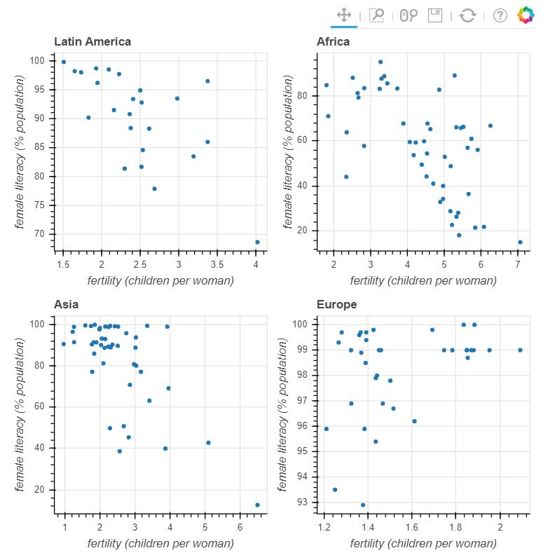
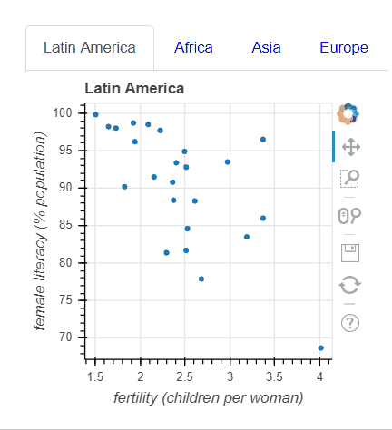
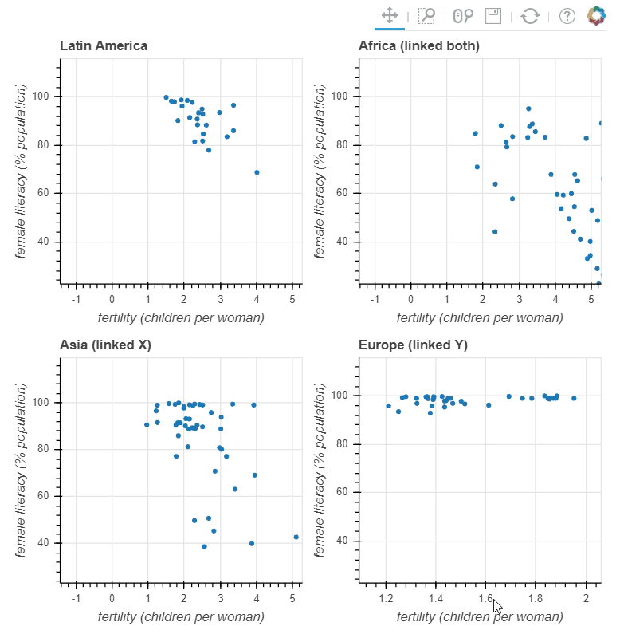
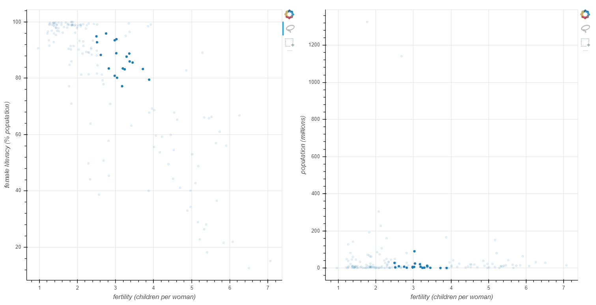
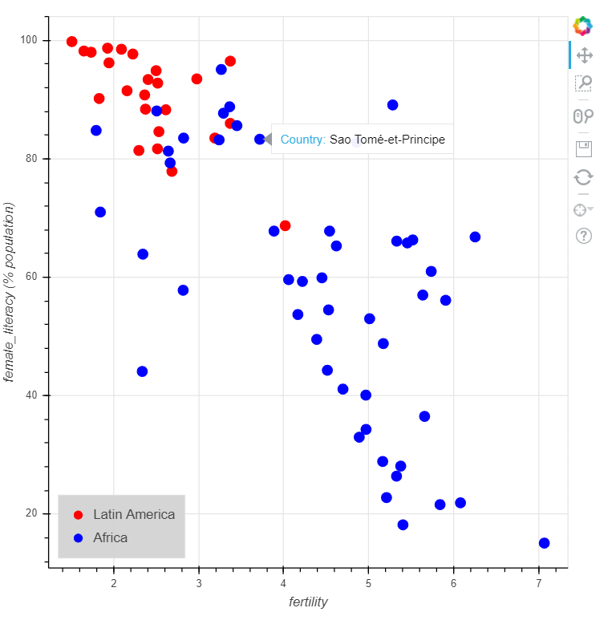

# Interactive Data Visualization with Bokeh

## Chapter 2 : Layouts, Interactions, and Annotations

### Creating rows/columns of plots
```python
# Import row from bokeh.layouts
from bokeh.layouts import row

# Create the first figure: p1
p1 = figure(x_axis_label='fertility (children per woman)', y_axis_label='female_literacy (% population)')

# Add a circle glyph to p1
p1.circle('fertility', 'female_literacy', source=source)

# Create the second figure: p2
p2 = figure(x_axis_label='population', y_axis_label='female_literacy (% population)')

# Add a circle glyph to p2
p2.circle('population', 'female_literacy', source=source)

# Put p1 and p2 into a horizontal row: layout
layout = row(p1, p2)
layout = column(p1, p2)

# Specify the name of the output_file and show the result
output_file('fert_row.html')
show(layout)
```
>>p1 on the left of p2
>>p1 above p2

### Creating gridded layouts
```python
# Import gridplot from bokeh.layouts
from bokeh.layouts import gridplot

# Create a list of plot p1 and p2: row1
row1 = [p1, p2]

# Create a list of plot p3 and p4: row1
row2 = [p3, p4]

# Create a gridplot using row1 and row2: layout
layout = gridplot([row1, row2])

# Specify the name of the output_file and show the result
output_file('grid.html')
show(layout)
```
>>

### Starting tabbed layouts
```python
# Import Panel from bokeh.models.widgets
from bokeh.models.widgets import Panel

# Create tab1 from plot p1: tab1
tab1 = Panel(child=p1, title='Latin America')

# Create tab2 from plot p2: tab2
tab2 = Panel(child=p2, title='Africa')

# Create tab3 from plot p3: tab3
tab3 = Panel(child=p3, title='Asia')

# Create tab4 from plot p4: tab4
tab4 = Panel(child=p4, title='Europe')
```

```python
# Import Tabs from bokeh.models.widgets
from bokeh.models.widgets import Tabs

# Create a Tabs layout: layout
layout = Tabs(tabs=[tab1, tab2, tab3, tab4])

# Specify the name of the output_file and show the result
output_file('tabs.html')
show(layout)
```
>>

### Linked axes
```python
# Link the x_range of p2 to p1: p2.x_range
p2.x_range = p1.x_range

# Link the y_range of p2 to p1: p2.y_range
p2.y_range = p1.y_range

# Link the x_range of p3 to p1: p3.x_range
p3.x_range = p1.x_range

# Link the y_range of p4 to p1: p4.y_range
p4.y_range = p1.y_range

# Specify the name of the output_file and show the result
output_file('linked_range.html')
show(layout)
```
>>

### Linked brushing
```python
# Create ColumnDataSource: source
source = ColumnDataSource(data)

# Create the first figure: p1
p1 = figure(x_axis_label='fertility (children per woman)', y_axis_label='female literacy (% population)',
            tools='box_select,lasso_select')

# Add a circle glyph to p1
p1.circle('fertility', 'female literacy', source=source)

# Create the second figure: p2
p2 = figure(x_axis_label='fertility (children per woman)', y_axis_label='population (millions)',
            tools='box_select,lasso_select')

# Add a circle glyph to p2
p2.circle('fertility', 'population', source=source)

# Create row layout of figures p1 and p2: layout
layout = row(p1, p2)

# Specify the name of the output_file and show the result
output_file('linked_brush.html')
show(layout)
```
>>

### 
```python
# Add the first circle glyph to the figure p
p.circle('fertility', 'female_literacy', source=latin_america, size=10, color="red", legend="Latin America")

# Add the second circle glyph to the figure p
p.circle('fertility', 'female_literacy', source=africa, size=10, color="blue", legend="Africa")

# Specify the name of the output_file and show the result
output_file('fert_lit_groups.html')
show(p)
```

```python
# Assign the legend to the bottom left: p.legend.location
p.legend.location = 'bottom_left'

# Fill the legend background with the color 'lightgray': p.legend.background_fill_color
p.legend.background_fill_color = 'lightgray'

# Specify the name of the output_file and show the result
output_file('fert_lit_groups.html')
show(p)
```

### Hover Tools
```python
# Import HoverTool from bokeh.models
from bokeh.models import HoverTool

# Create a HoverTool object: hover
hover = HoverTool(tooltips=[ ('Country', '@Country')])

# Add the HoverTool object to figure p
p.add_tools(hover)

# Specify the name of the output_file and show the result
output_file('hover.html')
show(p)
```
>>
