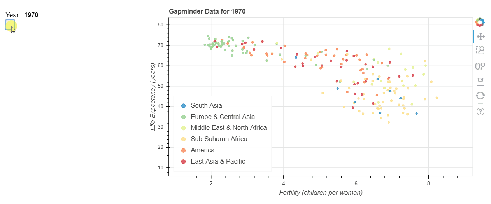
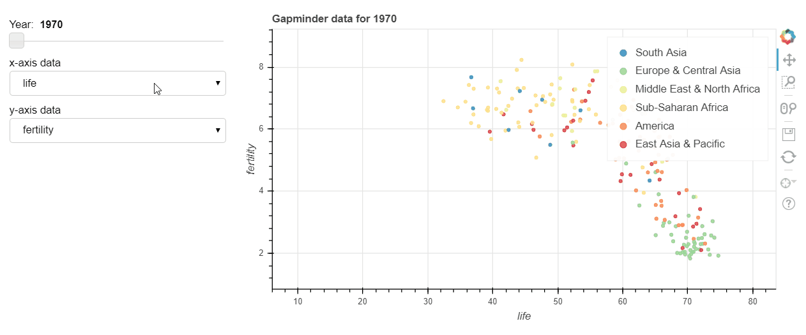

# Interactive Data Visualization with Bokeh

## Chapter 4 : Putting It All Together! A Case Study

### 
```python
# Perform necessary imports
from bokeh.io import output_file, show
from bokeh.plotting import figure
from bokeh.models import HoverTool, ColumnDataSource

# Make the ColumnDataSource: source
source = ColumnDataSource(data={
    'x'       : data.loc[1970].fertility,
    'y'       : data.loc[1970].life,
    'country' : data.loc[1970].Country,
})

# Create the figure: p
p = figure(title='1970', x_axis_label='Fertility (children per woman)', y_axis_label='Life Expectancy (years)',
           plot_height=400, plot_width=700,
           tools=[HoverTool(tooltips='@country')])

# Add a circle glyph to the figure p
p.circle(x='x', y='y', source=source)

# Output the file and show the figure
output_file('gapminder.html')
show(p)
```

```python
# Import the necessary modules
from bokeh.io import curdoc
from bokeh.models import ColumnDataSource
from bokeh.plotting import figure

# Make the ColumnDataSource: source
source = ColumnDataSource(data={
    'x'       : data.loc[1970].fertility,
    'y'       : data.loc[1970].life,
    'country' : data.loc[1970].Country,
    'pop'     : (data.loc[1970].population / 20000000) + 2,
    'region'  : data.loc[1970].region,
})

# Save the minimum and maximum values of the fertility column: xmin, xmax
xmin, xmax = min(data.fertility), max(data.fertility)

# Save the minimum and maximum values of the life expectancy column: ymin, ymax
ymin, ymax = min(data.life), max(data.life)

# Create the figure: plot
plot = figure(title='Gapminder Data for 1970', plot_height=400, plot_width=700,
              x_range=(xmin, xmax), y_range=(ymin, ymax))

# Add circle glyphs to the plot
plot.circle(x='x', y='y', fill_alpha=0.8, source=source)

# Set the x-axis label
plot.xaxis.axis_label ='Fertility (children per woman)'

# Set the y-axis label
plot.yaxis.axis_label = 'Life Expectancy (years)'

# Add the plot to the current document and add a title
curdoc().add_root(plot)
curdoc().title = 'Gapminder'
```

```python
# Make a list of the unique values from the region column: regions_list
regions_list = data.region.unique().tolist()

# Import CategoricalColorMapper from bokeh.models and the Spectral6 palette from bokeh.palettes
from bokeh.models import CategoricalColorMapper
from bokeh.palettes import Spectral6

# Make a color mapper: color_mapper
color_mapper = CategoricalColorMapper(factors=regions_list, palette=Spectral6)

# Add the color mapper to the circle glyph
plot.circle(x='x', y='y', fill_alpha=0.8, source=source,
            color=dict(field='region', transform=color_mapper), legend='region')

# Set the legend.location attribute of the plot to 'top_right'
plot.legend.location = 'top_right'

# Add the plot to the current document and add the title
curdoc().add_root(plot)
curdoc().title = 'Gapminder'
```

### Adding a slider to vary the year
```python
# Import the necessary modules
from bokeh.layouts import row, widgetbox
from bokeh.models import Slider

# Define the callback function: update_plot
def update_plot(attr, old, new):
    # Set the yr name to slider.value and new_data to source.data
    yr = slider.value
    new_data = {
        'x'       : data.loc[yr].fertility,
        'y'       : data.loc[yr].life,
        'country' : data.loc[yr].Country,
        'pop'     : (data.loc[yr].population / 20000000) + 2,
        'region'  : data.loc[yr].region,
    }
    source.data = new_data


# Make a slider object: slider
slider = Slider(start=1970, end=2010, step=1, value=1970, title='Year')

# Attach the callback to the 'value' property of slider
slider.on_change('value', update_plot)

# Make a row layout of widgetbox(slider) and plot and add it to the current document
layout = row(widgetbox(slider), plot)
curdoc().add_root(layout)
```
>>

Place this set of code in the update_plot function
```python
plot.title.text = 'Gapminder data for %d' % yr
```
>>

### 
```python
# Define the callback: update_plot
def update_plot(attr, old, new):
    # Read the current value off the slider and 2 dropdowns: yr, x, y
    yr = slider.value
    x = x_select.value
    y = y_select.value
    # Label axes of plot
    plot.xaxis.axis_label = x
    plot.yaxis.axis_label = y
    # Set new_data
    new_data = {
        'x'       : data.loc[yr][x],
        'y'       : data.loc[yr][y],
        'country' : data.loc[yr].Country,
        'pop'     : (data.loc[yr].population / 20000000) + 2,
        'region'  : data.loc[yr].region,
    }
    # Assign new_data to source.data
    source.data = new_data

    # Set the range of all axes
    plot.x_range.start = min(data[x])
    plot.x_range.end = max(data[x])
    plot.y_range.start = min(data[y])
    plot.y_range.end = max(data[y])

    # Add title to plot
    plot.title.text = 'Gapminder data for %d' % yr

# Create a dropdown slider widget: slider
slider = Slider(start=1970, end=2010, step=1, value=1970, title='Year')

# Attach the callback to the 'value' property of slider
slider.on_change('value', update_plot)

# Create a dropdown Select widget for the x data: x_select
x_select = Select(
    options=['fertility', 'life', 'child_mortality', 'gdp'],
    value='fertility',
    title='x-axis data'
)

# Attach the update_plot callback to the 'value' property of x_select
x_select.on_change('value', update_plot)

# Create a dropdown Select widget for the y data: y_select
y_select = Select(
    options=['fertility', 'life', 'child_mortality', 'gdp'],
    value='life',
    title='y-axis data'
)

# Attach the update_plot callback to the 'value' property of y_select
y_select.on_change('value', update_plot)

# Create layout and add to current document
layout = row(widgetbox(slider, x_select, y_select), plot)
curdoc().add_root(layout)
```
>>
