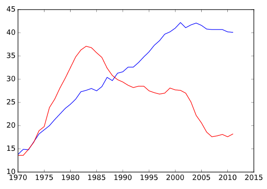
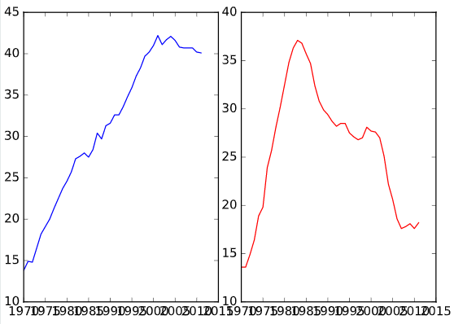
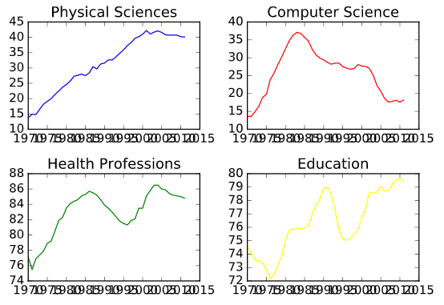

# Introduction to Data Visualization

## Chapter 1 : Customizing Plots

### Multiple plots on single axis
```python
# Import matplotlib.pyplot
import matplotlib.pyplot as plt

# Plot in blue the % of degrees awarded to women in the Physical Sciences
plt.plot(year, physical_sciences, color='blue')

# Plot in red the % of degrees awarded to women in Computer Science
plt.plot(year, computer_science, color='red')

# Display the plot
plt.show()
```
>>

### Using axes()
```python
# Create plot axes for the first line plot
plt.axes([0.05,0.05,0.425,0.9])

# Plot in blue the % of degrees awarded to women in the Physical Sciences
plt.plot(year, physical_sciences, color='blue')

# Create plot axes for the second line plot
plt.axes([0.525,0.05,0.425,0.9])

# Plot in red the % of degrees awarded to women in Computer Science
plt.plot(year, computer_science, color='red')

# Display the plot
plt.show()

```
>>

### Using subplot() (2)
```python
# Create a figure with 2x2 subplot layout and make the top left subplot active
plt.subplot(2, 2, 1) 

# Plot in blue the % of degrees awarded to women in the Physical Sciences
plt.plot(year, physical_sciences, color='blue')
plt.title('Physical Sciences')

# Make the top right subplot active in the current 2x2 subplot grid 
plt.subplot(2, 2, 2)

# Plot in red the % of degrees awarded to women in Computer Science
plt.plot(year, computer_science, color='red')
plt.title('Computer Science')

# Make the bottom left subplot active in the current 2x2 subplot grid
plt.subplot(2, 2, 3)

# Plot in green the % of degrees awarded to women in Health Professions
plt.plot(year, health, color='green')
plt.title('Health Professions')

# Make the bottom right subplot active in the current 2x2 subplot grid
plt.subplot(2, 2, 4)

# Plot in yellow the % of degrees awarded to women in the Education
plt.plot(year, education, color='yellow')
plt.title('Education')

# Improve the spacing between subplots and display them
plt.tight_layout()
plt.show()
```
>>

### Using xlim(), ylim()
```python
# Set the x-axis range
plt.xlim(1990,2010) 

# Set the y-axis range
plt.ylim(0,50)

OR

plt.axis((1990,2010,0,50))
```

### Using legend()
```python
plt.legend(loc='lower center')
```

### Using annotate()
```python
plt.annotate('Maximum', xy=(x,y), xytext=(xtext,ytext), arrowprops=dict(facecolor='black'))
```

### Modifying styles
```python
plt.style.use('ggplot')
print(plt.style.available)
```
>>['ggplot', 'bmh', 'dark_background', 'seaborn-deep', 'seaborn-muted', 'seaborn-colorblind', 'seaborn-pastel', 'seaborn-white', 'fivethirtyeight', 'seaborn-paper', 'seaborn-notebook', 'seaborn-dark', 'seaborn-ticks', 'grayscale', 'seaborn-darkgrid', 'seaborn-whitegrid', 'classic', 'seaborn-bright', 'seaborn-dark-palette', 'seaborn-talk', 'seaborn-poster']
