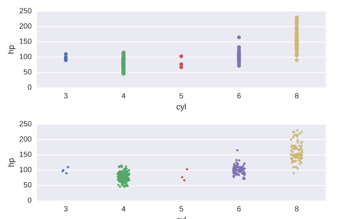
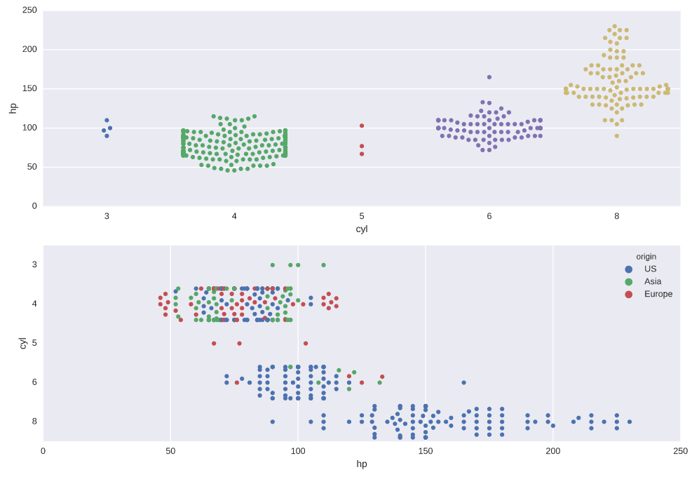
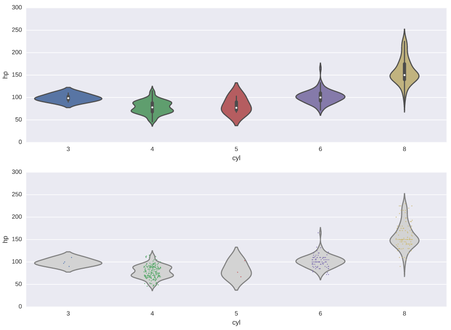
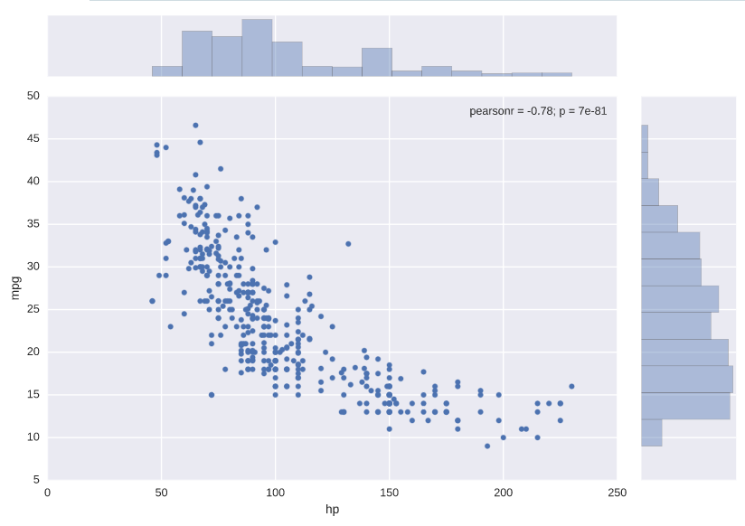
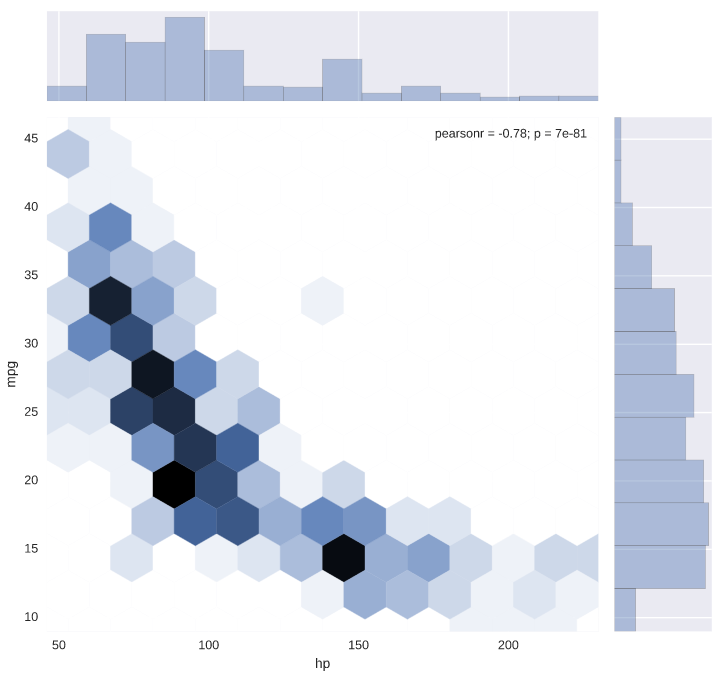
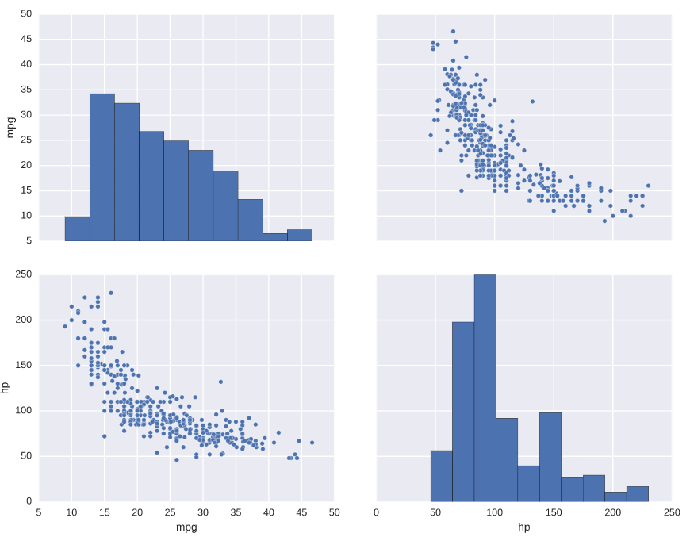
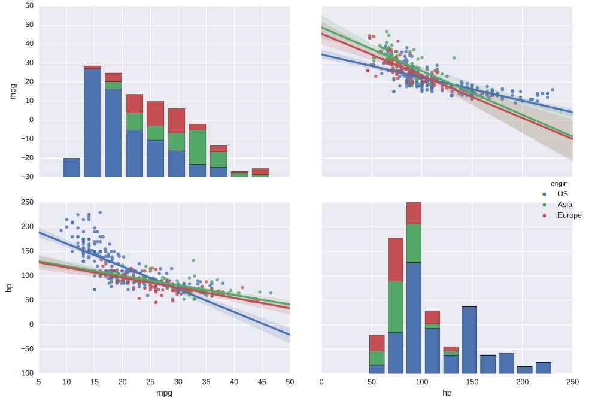

# Introduction to Data Visualization with Python

## Chapter 3 : Statistical plots with Seaborn

### Simple linear regressions
```python
sns.lmplot(x='area', y='price', data=df)
```

### Plotting residuals of a regression
Often, you don't just want to see the regression itself but also see the residuals to get a better idea how well the regression captured the data. Seaborn provides sns.residplot() for that purpose, visualizing how far datapoints diverge from the regression line.
```python
sns.residplot(x='hp', y='mpg', data=auto, color='green')
```


### Higher-order regressions
```python
# Generate a scatter plot of 'weight' and 'mpg' using red circles
plt.scatter(auto['weight'], auto['mpg'], label='data', color='red', marker='o')

# Plot in blue a linear regression of order 1 between 'weight' and 'mpg'
sns.regplot(x='weight', y='mpg', data=auto, scatter=None, color='blue', label='order 1')

# Plot in green a linear regression of order 2 between 'weight' and 'mpg'
sns.regplot(x='weight', y='mpg', data=auto, scatter=None, order=2, color='green', label='order 2')

# Add a legend and display the plot
plt.legend(loc='upper right')
plt.show()
```
>>

### Grouping linear regressions by hue
```python
sns.lmplot(x='weight', y='hp', data=auto, hue='origin', palette='Set1')
```

### Grouping linear regressions by row or column
Rather than overlaying linear regressions of grouped data in the same plot, we may want to use a grid of subplots. The sns.lmplot() accepts the arguments row and/or col to arrangements of subplots for regressions.
```python
# Plot a linear regression between 'weight' and 'hp' grouped row-wise by 'origin'
sns.lmplot(x='weight', y='hp', data=auto, row='origin')

# Display the plot
plt.show()
```


### Constructing strip plots
```python
# Make a strip plot of 'hp' grouped by 'cyl'
plt.subplot(2,1,1)
sns.stripplot(x='cyl', y='hp', data=auto)

# Make the strip plot again using jitter and a smaller point size
plt.subplot(2,1,2)
sns.stripplot(x='cyl', y='hp', data=auto, jitter=True, size=3)

# Display the plot
plt.show()
```
>>


### Constructing swarm plots
```python
# Generate a swarm plot of 'hp' grouped horizontally by 'cyl'  
plt.subplot(2,1,1)
sns.swarmplot(x='cyl', y='hp', data=auto)

# Generate a swarm plot of 'hp' grouped vertically by 'cyl' with a hue of 'origin'
plt.subplot(2,1,2)
sns.swarmplot(x='hp', y='cyl', data=auto, hue='origin', orient='h')

# Display the plot
plt.show()
```
>>


### Constructing violin plots
```python
# Generate a violin plot of 'hp' grouped horizontally by 'cyl'
plt.subplot(2,1,1)
sns.violinplot(x='cyl', y='hp', data=auto)

# Generate the same violin plot again with a color of 'lightgray' and without inner annotations
plt.subplot(2,1,2)
sns.violinplot(x='cyl', y='hp', data=auto, inner=None, color='lightgray')

# Overlay a strip plot on the violin plot
sns.stripplot(x='cyl', y='hp', data=auto, jitter=True, size=1.5)

# Display the plot
plt.show()
```
>>

### Plotting joint distributions
```python
# Generate a joint plot of 'hp' and 'mpg'
sns.jointplot(x='hp', y='mpg', data=auto)

# Display the plot
plt.show()
```
>>

```python
# Generate a joint plot of 'hp' and 'mpg' using a hexbin plot
sns.jointplot(x='hp', y='mpg', data=auto, kind='hex')

# Display the plot
plt.show()
```
>>


### Plotting distributions pairwise
```python
# Plot the pairwise joint distributions from the DataFrame 
sns.pairplot(auto)

# Display the plot
plt.show()
```
>>

```python
# Plot the pairwise joint distributions grouped by 'origin' along with regression lines
sns.pairplot(auto, hue='origin', kind='reg')

# Display the plot
plt.show()
```
>>

### Heatmaps
```python
# Print the covariance matrix
print(cov_matrix)

# Visualize the covariance matrix using a heatmap
sns.heatmap(cov_matrix)

# Display the heatmap
plt.show()
```
